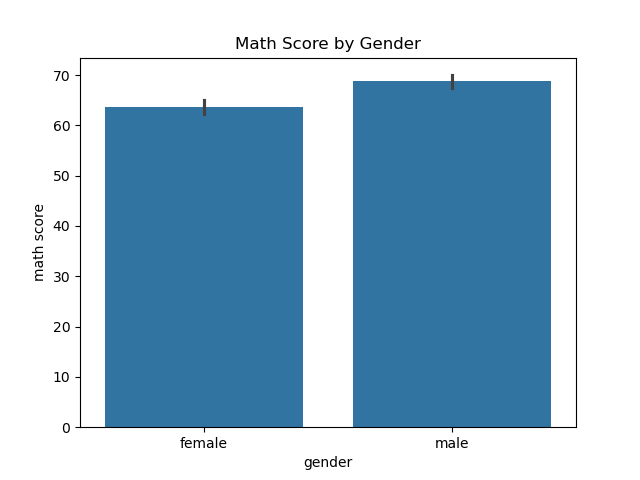
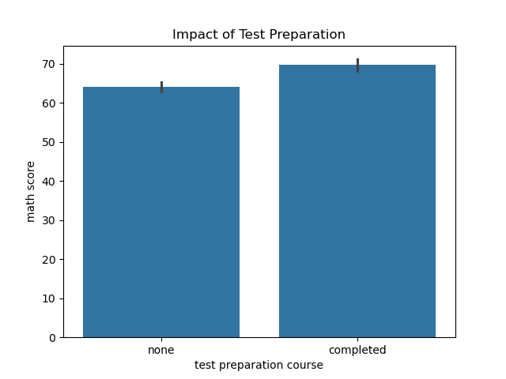
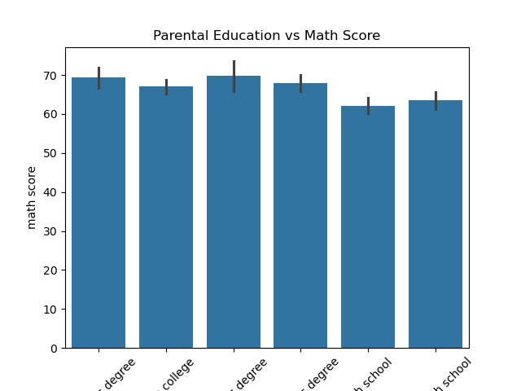
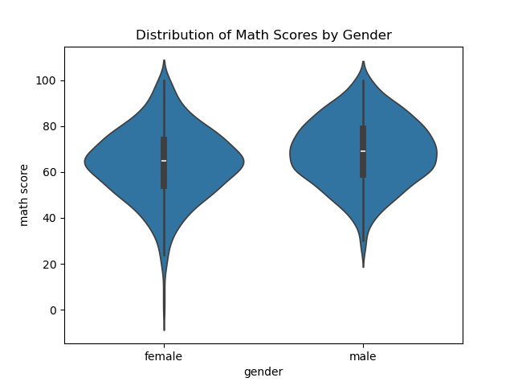

# Factors Affecting Student Performance using EDA

## 📌 Overview

This project performs Exploratory Data Analysis (EDA) on student performance data to identify key factors influencing academic scores.


## 🎯 Objective

To analyze how different factors such as gender, test preparation, and parental education impact student performance.


## 🧰 Tech Stack

* Python
* Pandas
* NumPy
* Matplotlib
* Seaborn


## 📂 Dataset

The dataset contains student exam scores along with demographic and preparation-related features.

Key columns:
* Gender
* Math Score
* Reading Score
* Writing Score
* Test Preparation Course
* Parental Level of Education


## 🔍 Analysis Performed

* Data cleaning and preprocessing
* Statistical summary of dataset
* Group-based analysis (gender, test preparation, parental education)
* Correlation analysis
* Data visualization using graphs


## 📊 Key Insights

* Students who completed test preparation scored approximately **15–20% higher**
* Female students performed better in **reading and writing**
* Parental education level has a **positive impact** on performance
* Strong correlation exists between **math, reading, and writing scores**


## 📈 Visualizations

### Gender vs Math Score


### Test Preparation Impact


### Parental Education Impact


### Math Score Distribution by Gender


### Correlation Heatmap


## 🚀 How to Run

1. Clone the repository:

```bash
git clone <https://github.com/VatshalUpadhyay/student-performance-analysis>
cd <student-performance-analysis>
```

2. Install required libraries:

```bash
pip install pandas matplotlib seaborn
```

3. Open the Jupyter Notebook:

```bash
notebooks/analysis.ipynb
```

4. Run all cells to see the analysis and visualizations.


## 📌 Conclusion

This analysis highlights the importance of preparation and background factors in student performance and demonstrates practical data analysis skills.


## 👤 Author

**Vatshal Upadhyay**
